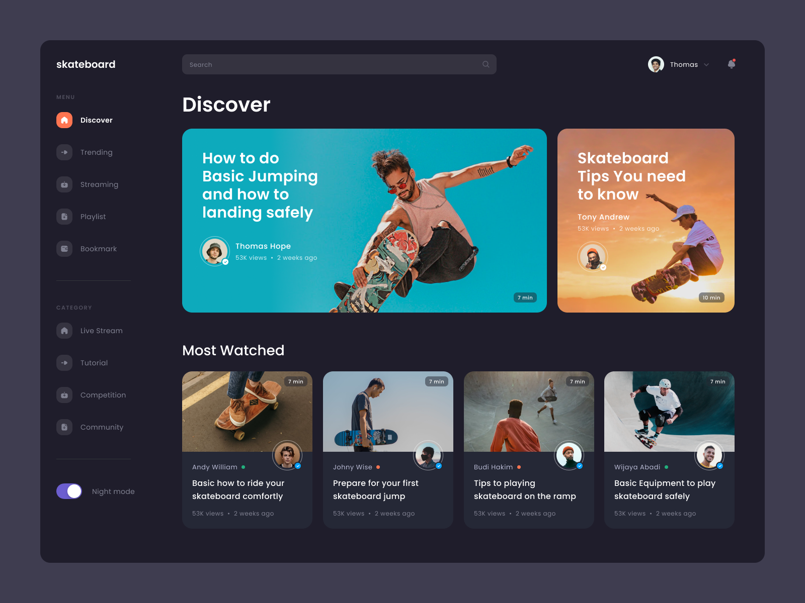

# MeTube - Full-stack video-hosting service app
## Idea

Attempt to recreate a full-stack app with guidance to see how big apps should be built. This is a small implementation of video hosting.

## Description

This app is meant to be a copy of a video-hosting platform (such as YouTube). Here you can watch videos, subscribe to channels, upload your own videos, have your own studio with the profile and more.

### Technologies used:
* React
* Node Express
* TypeORM
* Postgres database
* Typescript
* Tailwind for css
* Passport and bcrypt for auth
## About development

I opted for Nest JS and Next JS structure of the app but without actually using those frameworks. Instead I copied the app folder structure and logic into pure Node Express and React. After a lot of research I found this structure the most convenient and straightforward as well as easy to scale in the future. The design of this app was heavily inspired by [dribble](https://dribbble.com/shots/14958858--Exploration-Skateboard-Video-Platform)
